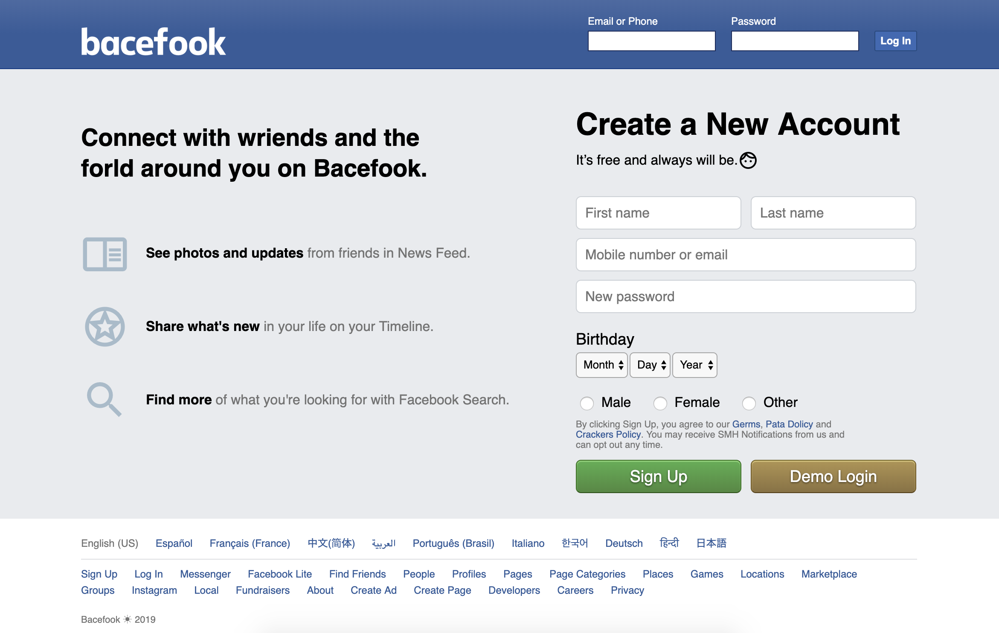
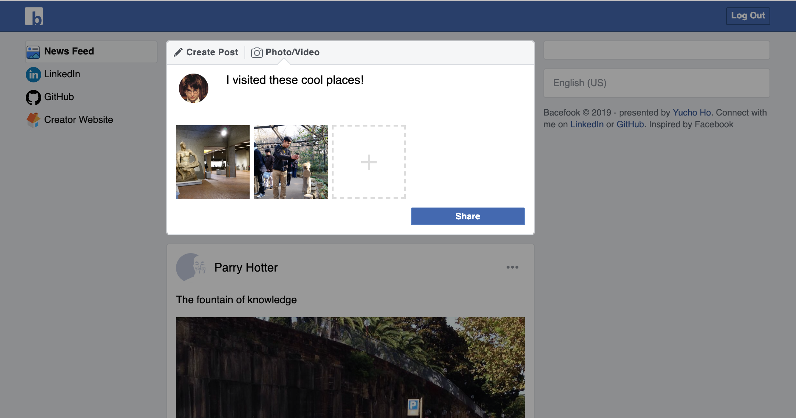

# Bacefook
[Live Demo](https://bacefook-demo.herokuapp.com/)

Bacefook is a Facebook clone implemented with Ruby on Rails and React. This single-page app allows users to register accounts, add friends, write posts, upload pictures, make comments, and hit likes.

## Splash Page


## Post Form (Modal)


Refer to [wiki page](https://github.com/yucho/bacefook/wiki) for details

## Technologies
#### Front End
- React
- Redux
- Webpack (ES6 + Babel)

#### Back End
- Ruby on Rails
- PostgreSQL
- REST API

### Languages
- Ruby v5.2
- JavaScript (ES2015)

### Challenges
In the spirit of early adoption, all components in this app are implemented using `React-hooks`, the new de-facto standard purveyed by the official React team. Not only do hooks reduce verbosity by half compared to the traditional class components, but also keeping the components as pure functions helps compiler optimization and reduces overheads. Taking a look at the following comparison:
```JSX
// Traditional class component (verbose and slower)
class CommentShow extends React.Component {
  constructor(props) {
    super(props);
    this.props = props;
    this.state = { menu: false };
    this.cb = this.cb.bind(this);
  }
  cb() {
    this.setState(() => { return { menu: true } });
  }
  componentDidMount() {
    subscribe(this.cb);
  }
  componentWillUnmount() {
    unsubscribe(this.cb);
  }
  render() {
    return <section>
      <Menu menu={this.state.menu} hide={() => this.setState(() => { menu: false })} />
      {this.props.comment.body}
    </section>;
  }
}

// React-hooks way (much cleaner!)
const CommentShow = ({ comment }) => {
  const [menu, show] = useState(false);
  useEffect(() => {
    const cb = () => show(true);
    subscribe(cb);
    return () => unsubscribe(cb);
  }, []);
  return <section>
    <Menu menu={menu} hide={() => show(false)} />
    {comment.body}
  </section>;
};
```
